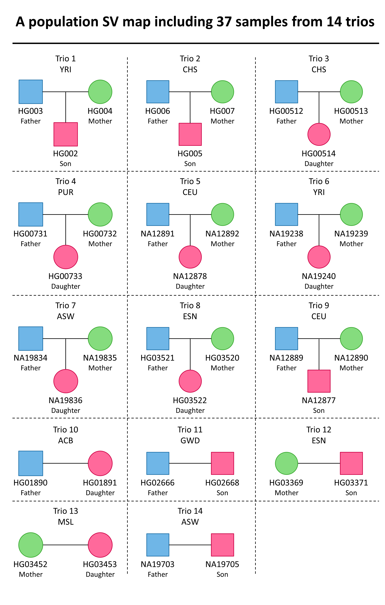
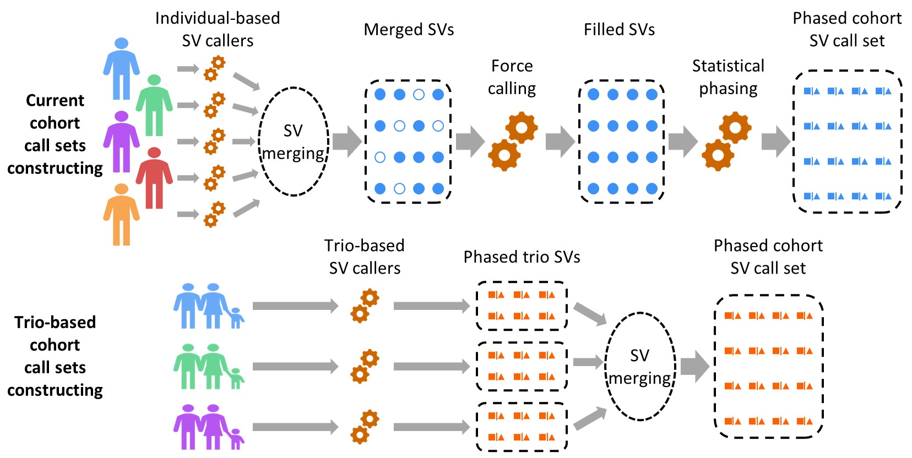
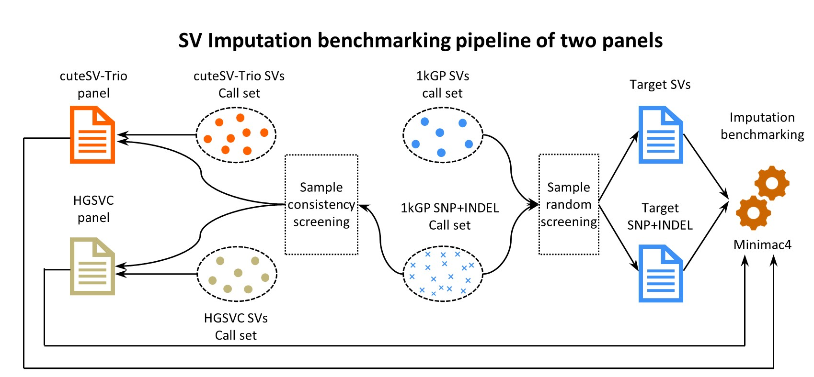

# cuteMap : A new trio-based third generation sequencing SV map.


## Introduction

The trio-based population SV atlas constructed using cuteSV-Trio integrates the most comprehensive currently publicly available three-generation trio data. It contains richer and more accurate SV records, significantly superior to existing population maps based on second-generation  and single-sample third-generation maps. Furthermore, cuteMap, constructed using a novel trio-based method based on cuteSV-Trio, eliminates the need for variant merging and statistic phasing, resulting in greater convenience and a lower error rate. In addition, a reference panel demonstrates its ability to facilitate high-precision SV imputation, filling the data gap in existing SV gene imputation.

## Construction process diagram

<div align="center">
  <a target="_blank">
    
  </a>
</div>

------


## Population SVs callset constructing

<div align="center">
  <a target="_blank">
    
  </a>
</div>

**The individual-based pipeline** containing four steps: individually detecting SV of each sample using traditional callers, merging SV of all samples, force calling SVs with genotype missing and statistical phasing using population-based tools. 

**The trio-based pipeline** based on cuteSV-Trio only contain two steps: discovery SVs in trio datas using cuteSV-Trio and merging SVs. 

Due to the full exploitation of family specific SV associations and the built-in SV phasing, cuteSV-Trio eliminates the force calling and statistical phasing steps in traditional pipelines, significantly shortening the construction process. It is worth mentioning that in the current construction pipeline, besides SV, SNVs also need to be characterized using four steps pipeline, but the new pipeline using cuteSV-Trio does not require SNV information.

```
# Construting population SV call set using cuteSV-Trio
# Detect SVs for each trio and duo using cuteSV-Trio

cuteSVTrio --performing_phasing -r ref.fasta -o trio.1.vcf -w work.trio.1/ --family_mode M1 --input_offspring trio.1/fam.1.bam --input_parent_1 trio.1/fam.2.bam --input_parent_2 trio.1/fam.3.bam --threads 32 --execute_stage 0 --min_support_list 5,5,5 ; 
cuteSVTrio --performing_phasing -r ref.fasta -o trio.2.vcf -w work.trio.2/ --family_mode M1 --input_offspring trio.2/fam.1.bam --input_parent_1 trio.2/fam.2.bam --input_parent_2 trio.2/fam.3.bam --threads 32 --execute_stage 0 --min_support_list 5,5,5 ; 
cuteSVTrio --performing_phasing -r ref.fasta -o duo.1.vcf -w work.duo.1/ --family_mode M2 --input_offspring duo.1/fam.1.bam --input_parent_1 duo.1/fam.2.bam --input_parent_2 duo.1/fam.3.bam --threads 32 --execute_stage 0 --min_support_list 5,5 ; 
cuteSVTrio --performing_phasing -r ref.fasta -o duo.2.vcf -w work.duo.2/ --family_mode M2 --input_offspring duo.2/fam.1.bam --input_parent_1 duo.2/fam.2.bam --input_parent_2 duo.2/fam.3.bam --threads 32 --execute_stage 0 --min_support_list 5,5 ; 

# Merge SVs using bcftools & Truvari
bcftools merge --force-samples -m none -o callset.vcf -l merge_vcf_list.txt # Each line in "merge_vcf_list.txt" is the path of the vcf file that needs to be merged
bgzip -f callset.vcf ; tabix -f callset.vcf.gz
truvari collapse -i callset.vcf -o callset.merged.vcf.gz -c callset.merged.collapse.vcf.gz -r 1000 -p 0 -P 0.7 -s 30 -S 100000
```


------


## Reference panel bulding and benchmarking

<div align="center">
  <a target="_blank">
    
  </a>
</div>

Given that small variants and structural variants in the 1kGP were generated by two independent pipelines, we isolated small variant data of consistent samples and integrated it with the structural variant sets of cuteSV-Trio and HGSVC, thereby yielding two distinct reference panels, respectively. The partial structural and small variant component of 1kGP was utilized as array genotype data to evaluate the accuracy of imputed genotypes. The samples in the target dataset are randomly selected from 1kGP samples.

```
# Taking chromosome 1 as an example
# First extract the samples from cuteSV-Trio, 1kGP and HGSVC and the relevant samples from imputation
python scripts/pick_samples_from_vcf.py chr1 
bgzip -f cuteSVTrio.chr1.overlap.sv.vcf ; tabix -f cuteSVTrio.chr1.overlap.sv.vcf.gz
bgzip -f HGSVC.chr1.overlap.sv.vcf ; tabix -f HGSVC.chr1.overlap.sv.vcf.gz
bgzip -f 1kGP.chr1.overlap.SNP_INDEL.vcf ; tabix -f 1kGP.chr1.overlap.SNP_INDEL.vcf.gz
bgzip -f 1kGP_chr1_SNP_INDEL.260.target.vcf ; tabix -f 1kGP_chr1_SNP_INDEL.260.target.vcf.gz

# Divide all SVs into two parts: target and answer (ground truth)
python scripts/split_vcf_file.py chr1
bgzip -f 1kGP_chr1_SV.260.target.vcf ; tabix -f 1kGP_chr1_SV.260.target.vcf.gz ; bcftools index 1kGP_chr1_SV.260.target.vcf.gz
bgzip -f 1kGP_chr1_SV.260.answer.vcf ; tabix -f 1kGP_chr1_SV.260.answer.vcf.gz ; bcftools index 1kGP_chr1_SV.260.answer.vcf.gz

# Bulid the cuteSV-Trio reference panel
bcftools concat 1kGP.chr1.overlap.SNP_INDEL.vcf.gz cuteSVTrio.chr1.overlap.sv.vcf.gz -o cuteSVTrio.1kGP.chr1.unsorted.vcf ; bgzip -f cuteSVTrio.1kGP.chr1.unsorted.vcf ; tabix -f cuteSVTrio.1kGP.chr1.unsorted.vcf.gz ; bcftools sort cuteSVTrio.1kGP.chr1.unsorted.vcf.gz -o cuteSVTrio.1kGP.chr1.panel.vcf ; bgzip -f cuteSVTrio.1kGP.chr1.panel.vcf ; tabix -f cuteSVTrio.1kGP.chr1.panel.vcf.gz 

# Bulid the HGSVC reference panel
bcftools concat 1kGP.chr1.overlap.SNP_INDEL.vcf.gz HGSVC.chr1.overlap.sv.vcf.gz -o HGSVC.1kGP.chr1.unsorted.vcf ; bgzip -f HGSVC.1kGP.chr1.unsorted.vcf ; tabix -f HGSVC.1kGP.chr1.unsorted.vcf.gz ; bcftools sort HGSVC.1kGP.chr1.unsorted.vcf.gz -o HGSVC.1kGP.chr1.panel.vcf ; bgzip -f HGSVC.1kGP.chr1.panel.vcf ; tabix -f HGSVC.1kGP.chr1.panel.vcf.gz ; 

# Bulid the target call set
bcftools concat 1kGP_chr1_SNP_INDEL.260.target.vcf.gz 1kGP_chr1_SV.260.target.vcf.gz -o 1kGP_chr1_all.260.unsorted.vcf ; bgzip -f 1kGP_chr1_all.260.unsorted.vcf ; bcftools sort 1kGP_chr1_all.260.unsorted.vcf.gz -o 1kGP_chr1_all.260.target.vcf ; bgzip -f 1kGP_chr1_all.260.target.vcf ; tabix -f 1kGP_chr1_all.260.target.vcf.gz

# Use minimac4 for SV imputation
minimac4 --compress-reference cuteSVTrio.1kGP.chr1.panel.vcf.gz > cuteSVTrio.1kGP.chr1.panel.msav -t 32
minimac4 --compress-reference HGSVC.1kGP.chr1.panel.vcf.gz > HGSVC.1kGP.chr1.panel.msav -t 32
minimac4 -f GT,HDS,GP -t 8 -c 5000000 cuteSVTrio.1kGP.chr1.panel.msav 1kGP_chr1_all.260.target.vcf.gz -o cuteSVTrio.1kGP.chr1.minimac4.vcf.gz
minimac4 -f GT,HDS,GP -t 8 -c 5000000 HGSVC.1kGP.chr1.panel.msav 1kGP_chr1_all.260.target.vcf.gz -o HGSVC.1kGP.chr1.minimac4.vcf.gz
```

------


## LatestUpdates

v1.0.0 (April 16, 2026) : 
1. The official version accompanying the formal paper submission.